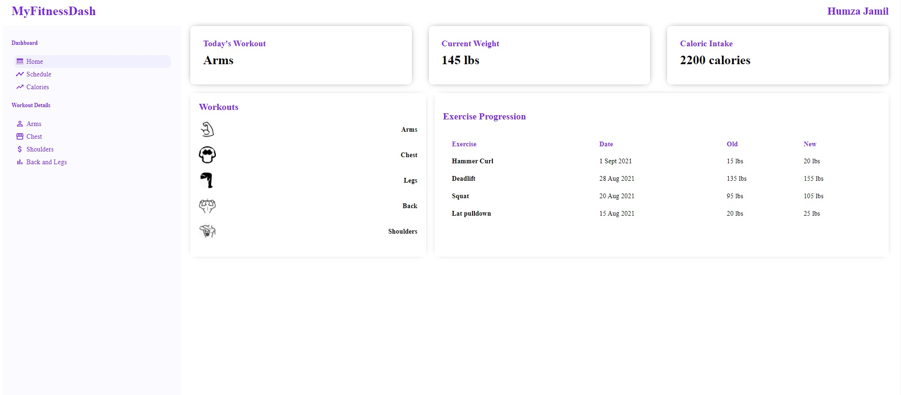

# Fitness Dashboard
## About

This is a fitness dashboard that allows users to track personal fitness information, such as workout schedule, progression on different exercises, weight, etc. Users can add their workout schedule and the dashboard will display the correct scheduled workout depending on the day of the week.

## Preview

## Technologies
- React
- Spring Boot
- Maven
- H2
- axios
## Description
The React client interacts with the Spring Boot REST controller using the axios library. The REST API enables CRUD operations with the H2 database. I used React lifecycle methods to render data and manipulate state. The user can add the workout schedule data to the database via a form field. Using JavaScript built-in date methods, the application determines what the day of the week is and renders the specific workout on the home page under "Today's Workout".
